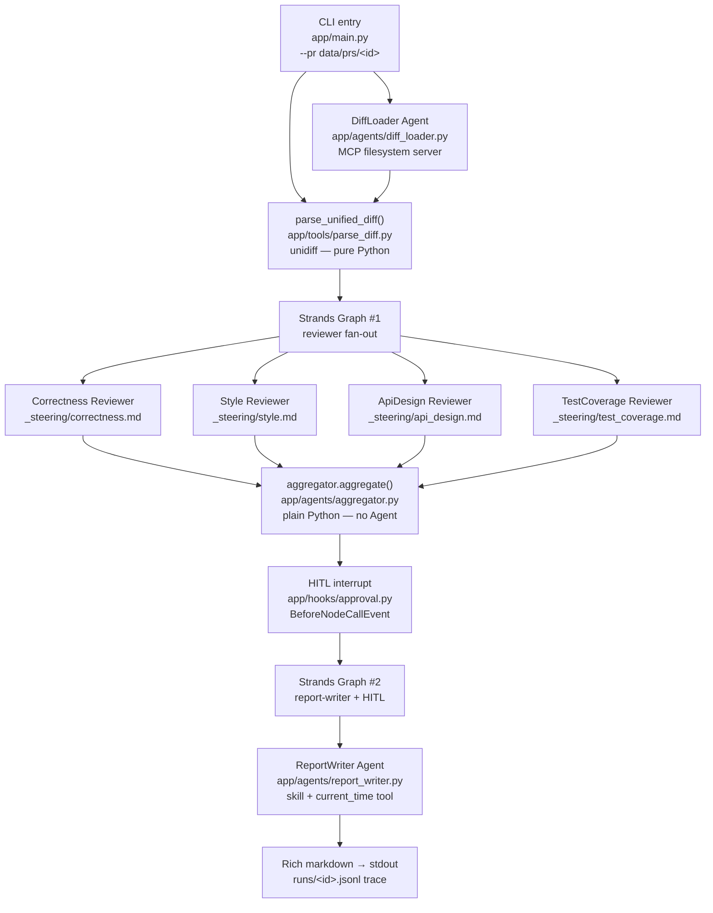

# Architecture

## System DAG



The four reviewer nodes in Graph #1 have **no edges** — `GraphBuilder` executes them concurrently. Graph #2 is a single node with a HITL interrupt gate.

---

## Design rationale

### Two Graphs, not one

Separating the reviewer fan-out (Graph #1) from the report-writer (Graph #2) isolates the HITL interrupt. If a reviewer fails mid-graph, it can't trap the report-writer in a partially-completed state — the aggregator normalises the surviving findings before Graph #2 starts. This also makes the HITL contract cleaner: the interrupt fires on a known, stable payload.

### Steering-prompt files instead of per-reviewer Python modules

Early slices (1–2) had `correctness_reviewer.py`, `style_reviewer.py`, etc. Slice 3 collapsed them into `_REVIEWER_CONFIGS` + `_steering/*.md`. The result: adding a reviewer is a markdown file + a one-liner tuple, not a new Python module. The steering file *is* the reviewer — its hard rules, severity ladder, and output contract are the agent's entire specification.

### MCP for diff loading

The diff-loader uses a local filesystem MCP server (`npx @modelcontextprotocol/server-filesystem`) with a direct-read fallback. The CLI doesn't need MCP — `Path(pr_dir / "pr.diff").read_text()` would suffice. The MCP path exists to demonstrate the integration pattern (rubric requirement #3). This is an honest forced use — the reflection calls it out rather than pretending it adds production value.

### Pydantic as the cross-agent data contract

Every boundary between components is a Pydantic model (`AddedLine`, `Hunk`, `Finding`, `ReviewerOutput`). Strands enforces `ReviewerOutput` via `structured_output_model` and re-prompts on validation failure — no hand-rolled retry loop. This also makes the aggregator deterministic: it operates on typed fields, not string parsing.

### RunLogger hook for observability

`app/hooks/instrumentation.py` registers `BeforeInvocationEvent` / `AfterInvocationEvent` and writes one JSONL line per agent call to `runs/<run_id>.jsonl`. The hook wraps every agent without changing any agent code — a clean separation of observability from logic. The JSONL schema is stable so tooling can grep over it; CloudWatch ingestion (Push 2) will point at the same log stream.

---

## Directory map (condensed)

```
swift-pr-reviewer/
├── app/
│   ├── main.py                 ← CLI; orchestrates both graphs + HITL loop
│   ├── graph.py                ← run_reviewers() + build_report_writer_graph()
│   ├── models.py               ← Pydantic: AddedLine, Hunk, Finding, ReviewerOutput
│   ├── provider.py             ← Anthropic + Bedrock providers (memoized)
│   ├── agents/
│   │   ├── diff_loader.py      ← MCP-filesystem reader Agent
│   │   ├── aggregator.py       ← plain Python dedup + sort
│   │   ├── report_writer.py    ← Strands Agent: skill + current_time
│   │   └── _steering/          ← system prompts (markdown, one per agent)
│   ├── tools/
│   │   └── parse_diff.py       ← parse_unified_diff() — unidiff wrapper
│   ├── hooks/
│   │   ├── instrumentation.py  ← RunLogger (JSONL trace per invocation)
│   │   └── approval.py         ← ApprovalHook (HITL interrupt + resume)
│   └── observability/          ← ADOT/CloudWatch stub (Push 2)
├── skills/
│   └── swift-review-rubric/SKILL.md
├── data/prs/                   ← PR fixtures (diff + metadata + ground_truth)
├── evals/                      ← run_evals.py + results/
└── submission/                 ← reflection.md + screenshots/
```
